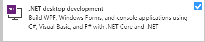
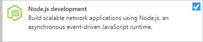
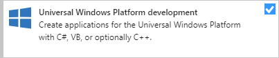

# CPSC-1012 - **Student Workbook** (Sep 2022)

[C# Fundamentals for Beginners](https://youtu.be/0QUgvfuKvWU) - 8 hr video for absolute beginners

> **STUDENT_NAME**

This repository is a **Student Workbook** containing [**demos**, **tutorials** and **practice materials**](./src/ReadMe.md). Learning Outcomes ([**LOGs**](./docs/learning_outcomes/ReadMe.md)) and other useful notes can be found in the [**docs** folder](./docs). Also, you are encouraged to use the [**docs/mynotes**](./docs/mynotes) folder for journaling what you are learning throughout this course.

> :warning: **Do *NOT*** use this repository for any assignments that are worth marks. :warning:

Additionally, you can find online notes at the [MS Teams Site](https://www.microsoft.com/en-ca/microsoft-teams/log-in) for the course. Also be sure to checkout out the topical [**Learning Outcomes**](https://.github.io/about/LOGs.html) used in class.

----

##  Software & Resources

Required tools for this course include:

- [Visual Studio Code](https://code.visualstudio.com) (see [Notes]() on VS Code extensions)
  - Alternativly, you can use [Visual Studio 2022, Community Edition](https://visualstudio.microsoft.com/) (see [Notes](#vs-2022-community) on the minimum version)
- [Git for Windows/macOS/Linux](https://git-scm.com/downloads)
- [GitHub CLI](https://cli.github.com/) (*Command-Line Interface*)

Other recommended resources include:

- [Learn Markdown](https://commonmark.org/help/)
- [Programming Fundamentals - An Object-Oriented Introduction to Programming in C#](https://programming-0101.github.io/TheBook/)

Advanced resources outside the scope of this course include:

- [Azure Developer Tools](https://azureforeducation.microsoft.com/devtools) - Sign in with your school-issued email address to get access to the free resources offered by Microsoft.

----

### VS 2022 Community

The latest version of [**Visual Studio 2022**](https://visualstudio.microsoft.com/) should be sufficient. If you need to upgrade, launch the Visual Studio Installer and upgrade through that tool.

|  |  |
|--------------------------------------------------------|----------------------------------------------------------------------|

You also should ensure you have the required workflows and components for this course.

| Required Workflows | Recommended Workflows | Individual Components | Extensions |
|--------------------|-----------------------|-----------------------|------------|
|  |  |  |  |
|  |  | |  |
| |  | | |
| |  | | |
| |  | | |
