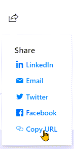
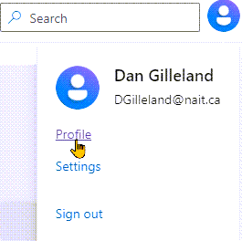

# Know Your Language 

> :bulb: Begin your journey with C# by taking the following modules from Microsoft Learn. You will need to sign in with an account in order to track your progress.

- [**Learn C#**](https://learn.microsoft.com/en-us/users/dotnet/collections/yz26f8y64n7k07) by Microsoft, consisting of the following Learning Paths.
  - [Take your first steps with C#](https://learn.microsoft.com/en-us/training/paths/csharp-first-steps/?source=docs&ns-enrollment-type=Collection&ns-enrollment-id=yz26f8y64n7k07) - 8 modules | 3 hr 51 min
  - [Add logic to your applications with C#](https://learn.microsoft.com/en-us/training/paths/csharp-logic/?source=docs&ns-enrollment-type=Collection&ns-enrollment-id=yz26f8y64n7k07) - 5 modules | 2 hr
  - [Work with data in C#](https://learn.microsoft.com/en-us/training/paths/csharp-data/?source=docs&ns-enrollment-type=Collection&ns-enrollment-id=yz26f8y64n7k07) - 5 modules | 2 hr 59 min

## Achievements

After completing each Microsoft learning path, add the link to the learning path into your workbook repository.

- TBA
- TBA
- TBA

 You will find the list of your completed learning paths on your user profile in Microsoft Learn.

 

## Video Resources

- [C# Fundamentals for Beginners](https://youtu.be/0QUgvfuKvWU) - 8 hr video for absolute beginners
